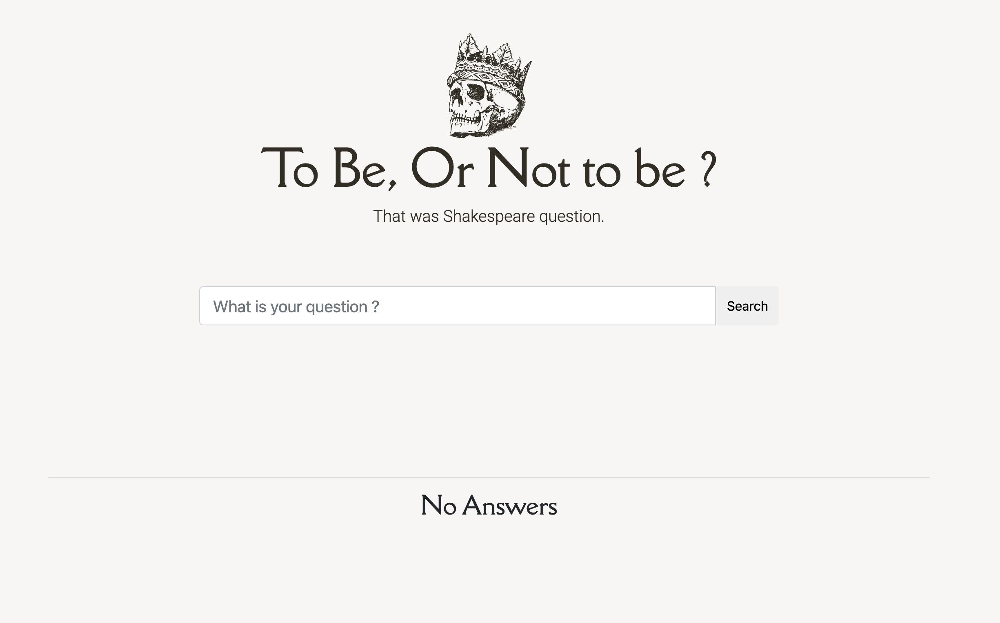
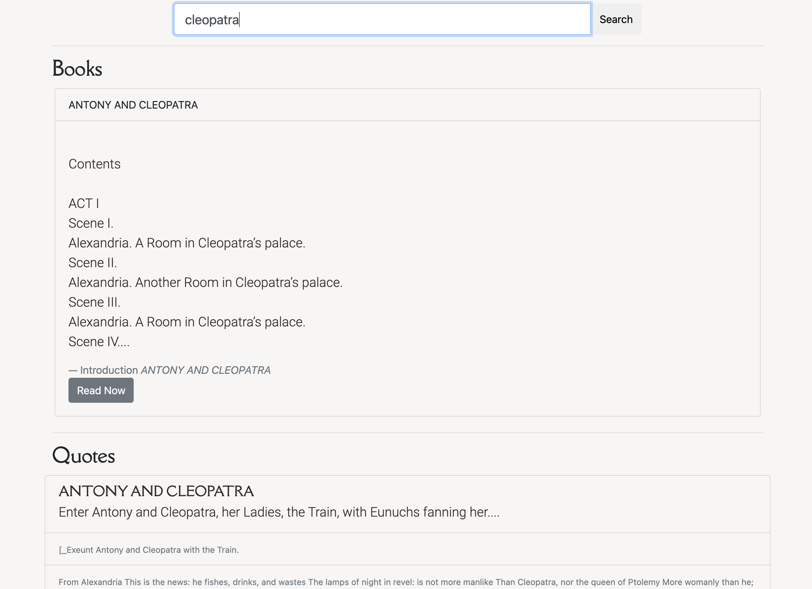
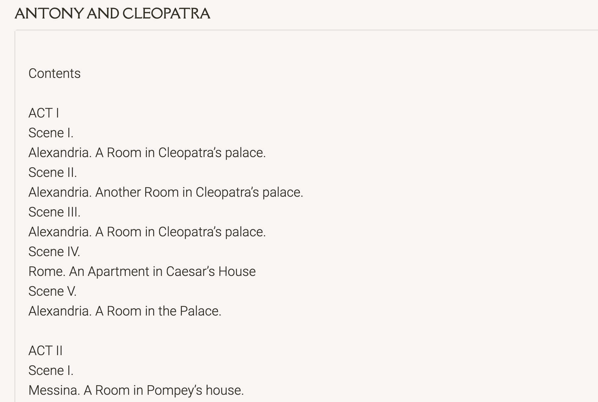
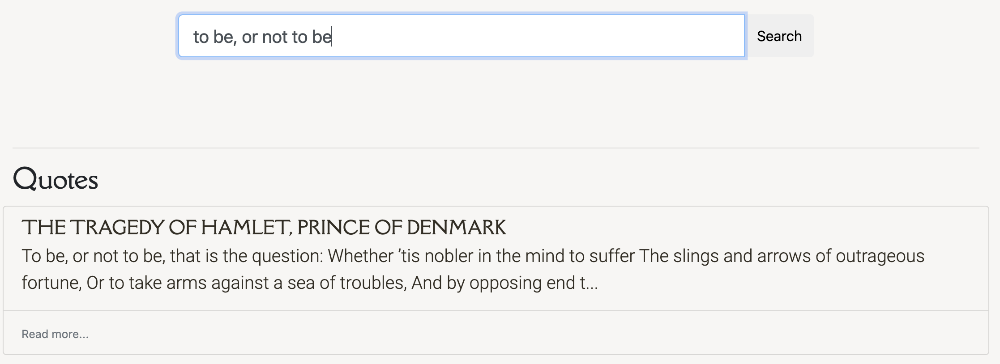

# ShakeSearch

Welcome to the Pulley Shakesearch Take-home Challenge! In this repository,
you'll find a simple web app that allows a user to search for a text string in
the complete works of Shakespeare.

You can see a live version of the app at
https://pulley-shakesearch.herokuapp.com/. Try searching for "Hamlet" to display
a set of results.

In it's current state, however, the app is just a rough prototype. The search is
case sensitive, the results are difficult to read, and the search is limited to
exact matches.

## Your Mission

Improve the search backend. Think about the problem from the **user's perspective**
and prioritize your changes according to what you think is most useful.

You can approach this with a back-end, front-end, or full-stack focus.

## Evaluation

We will be primarily evaluating based on how well the search works for users. A search result with a lot of features (i.e. multi-words and mis-spellings handled), but with results that are hard to read would not be a strong submission.

## Submission

1. Fork this repository and send us a link to your fork after pushing your changes.
2. Heroku hosting - The project includes a Heroku Procfile and, in its
   current state, can be deployed easily on Heroku's free tier.
3. In your submission, share with us what changes you made and how you would prioritize changes if you had more time.

## Solution

In my first contact with the challenge, I wrote this [wiki]([https://github.com/brunogs/shakesearch/wiki/Required-Changes]) with the required changes.
Once I started to improve the UI I understood that first I had to improve the backend search results and response format.
So I did the following steps:

1. I created a representation of a common book format: [code](https://github.com/brunogs/shakesearch/blob/master/src/book/book.go#L13-L21).
2. I implemented a parse to convert the file to my representation.
   1. The parsing code was segmented into 3 components: [novel](https://github.com/brunogs/shakesearch/blob/master/src/book/novel.go), [tragedy](https://github.com/brunogs/shakesearch/blob/master/src/book/tragedy.go), [poems](https://github.com/brunogs/shakesearch/blob/master/src/book/poems.go)
   2. It has another piece, [parser](https://github.com/brunogs/shakesearch/blob/master/src/book/parser.go) itself that chooses which component will be used.
3. With the books' representation in memory, I created another search approach using basically Regex and string manipulation.
   1. I created a search by book title, [code](https://github.com/brunogs/shakesearch/blob/master/src/search/searcher.go#L40-L52), it only verifies if the searched term exists on the title.
   2. I created a search by chapters content, [code](https://github.com/brunogs/shakesearch/blob/master/src/search/searcher.go#L76-L96), here has some rules:
      1. match all the chapters that have the **terms** searched with any text before and any content after until the next dot.
      2. I selected all the sentences from the chapters, and I filtered only ones with at least 40 characters.
      3. I avoided duplicated sentences, like this: *Enter Cleopatra, Charmian, Iras and Mardian.*
      4. With these rules, I was able to find meaningful quotes for the user search.
4. In the frontend I applied some style (background colors, new fonts, and bootstrap).
   
5. I separate results in **Books** and **Quotes**:
   
6. The books result has a button **Read Now**, with redirect to full book content:
   
7. The quotes result is limited by 5 per book and the last option *Read more*, redirect the user to book title search:
   

## Next steps

1. I tried to use some goroutines, but I think is possible to do better to improve performance.
2. Apply highlights in result text.
3. Adopt a search engine, like [bleve](https://blevesearch.com/) or elastic-search.
4. More search features using an engine, like autocomplete, mis-spellings, score results.
5. Reading a book on a big page is a little difficult, I could use pagination and persistence to preserve the user reading progress.
6. Modernize the frontend using React.
